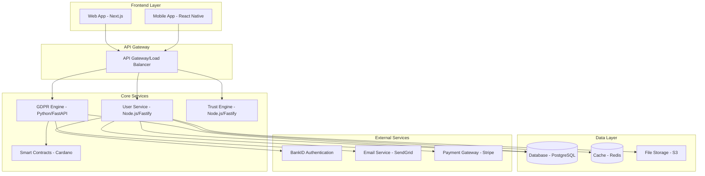

# DAMOCLES Platform Architecture 🏗️

> **Status:** Production Ready Core | **Updated:** December 2024

## 🎯 **Overview**

DAMOCLES is built as a **microservices architecture** designed for scalability, security, and maintainability. The platform automates GDPR compliance and debt resolution through a combination of web services, automation engines, and blockchain integration.

## 🏛️ **High-Level Architecture**



## 🔧 **Core Services**

### 🌐 **Web Application** (`apps/web`)
**Technology:** Next.js 14, React, TypeScript, Tailwind CSS

**Features:**
- Server-side rendering for SEO optimization
- Progressive Web App capabilities
- Real-time updates via WebSocket
- Responsive design for mobile/desktop

**Key Components:**
- Authentication flows (login/register)
- Dashboard with debt management
- GDPR request interface
- Settlement tracking
- Token management

**Status:** ✅ Production Ready

### 🔧 **User Service** (`services/user-service`)
**Technology:** Node.js, Fastify, Prisma ORM, JWT

**Responsibilities:**
- User authentication and authorization
- Debt management (CRUD operations)
- Creditor database management
- API rate limiting and security

**API Endpoints:**
```
POST /auth/login          # User authentication
POST /auth/register       # User registration
GET  /users/profile       # User profile management
POST /debts               # Create debt record
GET  /debts               # List user debts
GET  /debts/:id           # Get debt details
PUT  /debts/:id           # Update debt
DELETE /debts/:id         # Delete debt
GET  /creditors           # List creditors
GET  /creditors/search    # Search creditors
```

**Status:** ✅ Production Ready

### 🤖 **GDPR Engine** (`services/gdpr-engine`)
**Technology:** Python, FastAPI, Jinja2, AsyncIO

**Responsibilities:**
- Generate Norwegian GDPR request templates
- Email automation with tracking
- Violation detection and scoring
- Settlement negotiation automation

**Key Features:**
- **Template System:** Specialized templates for banks, BNPL, debt collectors
- **Email Automation:** SMTP integration with tracking pixels
- **Violation Detection:** AI-powered pattern recognition
- **SWORD Protocol:** Collective action coordination

**API Endpoints:**
```
POST /gdpr/generate       # Generate GDPR request
POST /gdpr/send/:id       # Send GDPR request
GET  /gdpr/requests/:user # Get user requests
GET  /gdpr/violations     # Get violation analysis
POST /gdpr/sword          # Trigger collective action
```

**Status:** ✅ Production Ready

### 🧠 **Trust Engine** (`services/trust-engine`)
**Technology:** Node.js, Fastify, TypeScript, Sacred Architecture

**Responsibilities:**
- Mathematical trust score calculation using authority weights
- Contradiction detection with Norwegian legal hierarchy
- Kindness Algorithm for user-centered interactions
- SWORD Protocol eligibility analysis

**Core Components:**
- **TrustScore Engine:** `TrustScore = Σ(Authority_Weight × Authority_Score × Cross_Vector_Confidence) - Σ(Contradiction_Penalty × Authority_Differential)`
- **Authority Hierarchy:** Complete Norwegian legal authority mapping (Høyesterett → Inkassoselskap)
- **Contradiction Detection:** 6 types including settlement logic, data contradictions, authority hierarchy violations
- **Kindness Algorithm:** Consciousness-serving user interactions with gentle messaging

**API Endpoints:**
```
POST /trust/analyze           # Analyze claims for trustworthiness
POST /trust/damocles-analyze  # DAMOCLES-specific debt analysis
GET  /trust/authorities       # List Norwegian legal authorities
POST /trust/authorities/compare # Compare authority levels
GET  /trust/contradictions/types # Available contradiction types
POST /trust/kindness/response # Generate kind response
GET  /trust/education/sources # Educational content
GET  /trust/health           # Health check
POST /trust/test             # Testing endpoint
```

**Sacred Architecture Principles:**
- **Kindness × Scale × Time = Universal Flourishing**
- Service-oriented vs extraction behavior classification
- User agency preservation with dismissible interactions
- Anti-manipulation detection patterns
- Golden ratio scaling for love/service compound benefits

**Status:** ✅ Production Ready

## 💾 **Data Architecture**

### 🗄️ **Database Schema** (Prisma ORM)

```prisma
model User {
  id              String   @id @default(cuid())
  email           String   @unique
  phoneNumber     String?
  personalNumber  String   @unique
  bankIdVerified  Boolean  @default(false)
  swordBalance    Float    @default(0)
  createdAt       DateTime @default(now())
  updatedAt       DateTime @updatedAt
  
  debts           Debt[]
  gdprRequests    GDPRRequest[]
}

model Debt {
  id                String      @id @default(cuid())
  userId            String
  creditorId        String
  originalAmount    Float
  currentAmount     Float
  interestRate      Float?
  dueDate           DateTime?
  status            DebtStatus  @default(ACTIVE)
  documents         String[]    // File paths
  createdAt         DateTime    @default(now())
  
  user              User        @relation(fields: [userId], references: [id])
  creditor          Creditor    @relation(fields: [creditorId], references: [id])
  gdprRequests      GDPRRequest[]
}

model Creditor {
  id               String   @id @default(cuid())
  name             String
  organizationId   String?  @unique
  email            String?
  phone            String?
  address          String?
  type             CreditorType
  violationScore   Float    @default(0)
  lastViolationUpdate DateTime @default(now())
  
  debts            Debt[]
}

model GDPRRequest {
  id               String        @id @default(cuid())
  userId           String
  debtId           String?
  creditorId       String
  referenceId      String        @unique
  requestType      RequestType   @default(ARTICLE_15)
  status           RequestStatus @default(PENDING)
  content          String?
  sentAt           DateTime?
  responseDue      DateTime?
  responseReceived DateTime?
  violationCount   Int           @default(0)
  createdAt        DateTime      @default(now())
  
  user             User          @relation(fields: [userId], references: [id])
  debt             Debt?         @relation(fields: [debtId], references: [id])
}
```

### 📊 **Caching Strategy** (Redis)
- **Session Management:** User authentication tokens
- **API Rate Limiting:** Request quotas per user
- **GDPR Request Status:** Real-time status updates
- **Violation Scores:** Cached creditor risk assessments

## 🔐 **Security Architecture**

### 🛡️ **Authentication & Authorization**
- **JWT Tokens:** Stateless authentication with 24h expiry
- **BankID Integration:** Norwegian identity verification
- **Role-Based Access:** User/Admin/Developer permissions
- **API Rate Limiting:** 1000 requests/hour per user

### 🔒 **Data Protection**
- **Encryption at Rest:** Database and file storage encrypted
- **TLS/HTTPS:** All communications encrypted in transit
- **GDPR Compliance:** Data minimization and right to erasure
- **Audit Logging:** All sensitive operations logged

### 🚨 **Security Monitoring**
- **Pre-commit Hooks:** Detect secrets and vulnerabilities
- **Dependency Scanning:** Automated vulnerability detection
- **Container Security:** Docker image scanning
- **Real-time Monitoring:** Anomaly detection and alerting

## 🌐 **Deployment Architecture**

### 🐳 **Containerization** (Docker)
```yaml
services:
  web:
    build: ./apps/web
    ports: ["3001:3000"]
    environment:
      - NEXT_PUBLIC_API_URL=http://user-service:3000
      
  user-service:
    build: ./services/user-service
    ports: ["3000:3000"]
    environment:
      - DATABASE_URL=${DATABASE_URL}
      - JWT_SECRET=${JWT_SECRET}
      
  gdpr-engine:
    build: ./services/gdpr-engine
    ports: ["8001:8001"]
    environment:
      - SMTP_SERVER=${SMTP_SERVER}
      - DATABASE_URL=${DATABASE_URL}
      
  trust-engine:
    build: ./services/trust-engine
    ports: ["8002:8002"]
    environment:
      - NODE_ENV=production
      - API_VERSION=1.0.0
      
  database:
    image: postgres:15
    environment:
      - POSTGRES_DB=damocles
      - POSTGRES_USER=${DB_USER}
      - POSTGRES_PASSWORD=${DB_PASSWORD}
      
  redis:
    image: redis:7-alpine
    ports: ["6379:6379"]
```

### ☁️ **Cloud Infrastructure**
- **Application Hosting:** AWS ECS or DigitalOcean App Platform
- **Database:** Managed PostgreSQL (AWS RDS/DO Managed DB)
- **File Storage:** AWS S3 or DigitalOcean Spaces
- **CDN:** CloudFlare for static asset delivery
- **Monitoring:** Sentry for error tracking, DataDog for metrics

### 🚀 **CI/CD Pipeline**
```yaml
# .github/workflows/deploy.yml
name: Deploy to Production
on:
  push:
    branches: [main]

jobs:
  test:
    runs-on: ubuntu-latest
    steps:
      - name: Run Tests
        run: npm test && python -m pytest
      
  security:
    runs-on: ubuntu-latest  
    steps:
      - name: Security Scan
        run: |
          npm audit --audit-level=high
          bandit -r services/gdpr-engine
          
  deploy:
    needs: [test, security]
    runs-on: ubuntu-latest
    steps:
      - name: Deploy to Production
        run: docker-compose -f docker-compose.prod.yml up -d
```

## ⚡ **Performance Optimization**

### 🏃 **Frontend Performance**
- **Code Splitting:** Lazy loading for route components
- **Image Optimization:** Next.js automatic image optimization
- **Bundle Analysis:** Webpack bundle analyzer for size optimization
- **Caching:** Service worker for offline functionality

### 🔧 **Backend Performance**
- **Connection Pooling:** Database connection optimization
- **Query Optimization:** Prisma query performance monitoring
- **Async Processing:** Background jobs for email sending
- **Load Balancing:** Multiple service instances

### 📈 **Scalability**
- **Horizontal Scaling:** Stateless services for easy scaling
- **Database Sharding:** User-based data partitioning
- **CDN Distribution:** Global content delivery
- **Auto-scaling:** Container orchestration based on load

## 🔗 **Integration Points**

### 🏦 **BankID Integration**
```javascript
// BankID authentication flow
const bankIdAuth = {
  initiate: (personalNumber) => {
    // Start BankID authentication
    return bankId.authenticate(personalNumber)
  },
  
  verify: (transactionId) => {
    // Verify authentication result
    return bankId.collect(transactionId)
  },
  
  getUserData: (token) => {
    // Extract user information
    return bankId.parseUserData(token)
  }
}
```

### 💳 **Payment Processing**
```javascript
// Stripe integration for token purchases
const payment = {
  createIntent: (amount, currency = 'NOK') => {
    return stripe.paymentIntents.create({
      amount: amount * 100, // Convert to øre
      currency: currency,
      metadata: { type: 'sword_tokens' }
    })
  },
  
  webhook: (event) => {
    // Handle payment completion
    if (event.type === 'payment_intent.succeeded') {
      updateUserTokenBalance(event.data.object.metadata.userId)
    }
  }
}
```

### 📧 **Email Service Integration**
```python
# SendGrid integration for GDPR emails
class EmailService:
    def __init__(self):
        self.sg = SendGridAPIClient(api_key=settings.SENDGRID_API_KEY)
    
    async def send_gdpr_request(self, template_data):
        message = Mail(
            from_email='gdpr@damocles.no',
            to_emails=template_data['creditor_email'],
            subject=template_data['subject'],
            html_content=template_data['content']
        )
        
        response = self.sg.send(message)
        return response
```

## 🔄 **Data Flow**

### 📱 **User Journey Flow**
1. **Authentication:** User logs in via BankID
2. **Debt Upload:** User uploads debt document
3. **Processing:** System extracts creditor information
4. **GDPR Generation:** Automated legal request creation
5. **Email Sending:** Automated email to creditor
6. **Tracking:** Monitor response and violations
7. **Settlement:** Collective action coordination

### 🔁 **API Request Flow**
```
Client → API Gateway → Service → Database → Response
```

### 📊 **Real-time Updates**
- **WebSocket Connections:** Live status updates
- **Server-Sent Events:** GDPR request progress
- **Push Notifications:** Mobile app alerts

## 📋 **Monitoring & Analytics**

### 📈 **Application Metrics**
- **User Registration Rate:** Daily/monthly signups
- **Debt Processing Volume:** Amount and count
- **GDPR Success Rate:** Response and violation rates
- **Settlement Outcomes:** Debt reduction statistics

### 🔍 **Technical Metrics**
- **Response Times:** API endpoint performance
- **Error Rates:** Service reliability monitoring
- **Resource Usage:** CPU, memory, database connections
- **Security Events:** Failed authentication attempts

### 📊 **Business Intelligence**
- **Creditor Analysis:** Violation patterns and scores
- **User Behavior:** Platform usage analytics
- **Legal Effectiveness:** Settlement success rates
- **Token Economics:** SWORD token circulation and value

---

## 🚀 **Next Steps**

### Q1 2025 - Production Deployment
- [ ] Deploy to cloud infrastructure
- [ ] Implement real BankID integration
- [ ] Set up monitoring and alerting
- [ ] Security audit and penetration testing

### Q2 2025 - Scale & Optimize
- [ ] Performance optimization
- [ ] Advanced analytics implementation
- [ ] Mobile app development
- [ ] International market preparation

---

*Architecture designed for justice, built for scale.* ⚔️